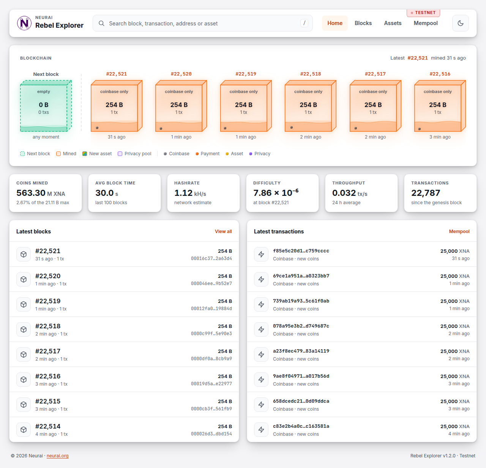

# Rebel Explorer

<p align="center">
  
</p>

A block explorer for the Neurai (XNA) blockchain, styled after the Neurai web
wallet. It works on phones and desktops, in light and dark mode.

- **Home**: the chain drawn as a row of glass blocks, the way mempool.space
  does it: the next block in green (what waits in the mempool) and the latest
  mined blocks in orange, each with its fee rate, size and transactions, and a
  liquid that rises with one bubble per transaction. A rainbow edge marks a
  block where an asset was created, a purple one a block where coins entered
  or left a privacy pool. New blocks slide in without reloading. Below it, network stats
  (coins mined so far, block time, hashrate, difficulty, throughput and, on
  mainnet, the XNA price) and the latest blocks and transactions.
- **Blocks**: every block, page by page, and each block with its reward,
  fees, transactions and links to the previous and next block (← and → work too).
- **Transactions**: status, kind (payment, asset issue, asset transfer,
  DePIN, coinbase, privacy pool deposit, withdrawal or private transfer…), fee and fee rate, and the flow from inputs to outputs, with
  the share of each output, change back to the sender, burns, IPFS memos and
  where each output was spent.
- **Addresses**: balance, pending amounts, assets held, activity filtered by
  XNA or assets, balance over time, unspent outputs and a QR code.
- **Assets**: every asset with its type, supply and holders, and each asset
  with its owner, holders, issuance and sub-assets.
- **Mempool**: transactions waiting for a block.

## Before you install
- You need to have Node.js and Git installed.

- You can run the Explorer and use an online Neurai RPC service such as
   * https://rpc-main.neurai.org click on mainnet or testnet to find the endpoints.

- The idea is that you run your own Neurai node.
The node needs to be fully indexed and your neurai.conf must include
    * txindex=1
    * addressindex=1
    * assetindex=1
    * timestampindex=1
    * spentindex=1

- If the explorer talks to the node through an RPC service such as
  neurai-wallet-services, the service must allow these methods: `getbestblockhash`, `getblock`, `getblockhash`,
  `getblockheader`, `getblockchaininfo`, `getchaintxstats`, `getnetworkhashps`,
  `getmempoolinfo`, `getrawmempool`, `getmempoolentry`, `getrawtransaction`,
  `getspentinfo`, `validateaddress`, `getaddressbalance`, `getaddressdeltas`,
  `getaddressutxos`, `getaddressmempool`, `getassetdata`, `listassets` and
  `listaddressesbyasset`. The public whitelist of neurai-wallet-services
  allows all of them; `gettxoutsetinfo`, for the coins in circulation, is
  optional (without it the home page uses the emission schedule).

## How to install
Clone the git repo

Run `npm install`

Run `npm run build`

## How to start

Run `npm start`
### Configuration

The first time you try to start the Explorer, a config.json file will be created.
Update the config.json file with your information and restart restart the node.js app
```
{
    "baseCurrency": "XNA",
    "neurai_password": "anonymous",
    "neurai_username": "anonymous",
    "neurai_url": "https://rpc-main.neurai.org/rpc",
    "httpPort": 8888,
    "headline": "Neurai mainnet",
    "theme": "dark",
    "ipfs_gateway": "https://gateway.pinata.cloud/ipfs/",
    "price_lookup_enabled": true
}
```

- `theme` (`light` or `dark`) is the default until a visitor picks one with
  the toggle; their choice is remembered in the browser.
- `ipfs_gateway` opens IPFS files and memos of assets.
- `price_lookup_enabled`: on mainnet the server asks CoinGecko for the XNA
  price once a minute. Set it to `false` to turn that off. Testnet never shows
  a price.
- `headline` is kept for compatibility; the network label in the header comes
  from the node.

Config is only read once at startup, so you need to restart the app if you change config.

## URL scheme

The explorer uses path-based URLs. Every route is served by the SPA, so
deep-links can be shared and bookmarked.

| Path                  | Shows                                        | Example                                                               |
|-----------------------|----------------------------------------------|-----------------------------------------------------------------------|
| `/`                   | Home — latest block, stats, blocks and txs   | `/`                                                                   |
| `/blocks`             | Every block, 25 per page                     | `/blocks?before=1573300`                                              |
| `/block/:height`      | Block by height                              | `/block/1573322`                                                      |
| `/blockhash/:hash`    | Block by hash                                | `/blockhash/0000000000000abc…`                                        |
| `/tx/:txid`           | Transaction details                          | `/tx/6eae2ec2f5d896a8f39e6005c19ac6abf39268edfc320a8de9deebdcc57260c0`|
| `/address/:address`   | Address balance, UTXOs and history           | `/address/NihAfZynHrTtYPH8ZSUEhLSCVMstLSV5qN`                         |
| `/assets`             | Paginated list of assets                     | `/assets`                                                             |
| `/asset/:name`        | Asset detail and holders                     | `/asset/SWAP`                                                         |
| `/mempool`            | Transactions waiting for a block             | `/mempool`                                                            |

Notes:
- The search bar accepts a block height, block hash, transaction id, address
  or asset name (in any case); it routes to the matching URL automatically.
- In-app links to a block prefer `/block/:height` when the height is known
  and fall back to `/blockhash/:hash` otherwise.
- Asset names are URL-encoded, so names containing `/` or `#` work.
- Pages keep their state in the query string, so it survives a reload and can
  be shared: `?page=` on lists, `?filter=xna|assets` on an address,
  `?q=`, `?type=` and `?sort=newest` on the assets page.
- `/tx/:txid?from=:address` highlights that address in the transaction. The
  activity of an address links to its transactions this way.

## API

The pages read their data from these endpoints. Amounts are decimal strings
(`"1234.5"`), never numbers, so no digit is lost.

| Endpoint                                   | Returns                                                         |
|--------------------------------------------|-----------------------------------------------------------------|
| `GET /api/stats`                           | Height, coins mined, difficulty, hashrate, block time, tx rate, mempool, price |
| `GET /api/chain?count=`                    | The next block and the latest mined ones: fees, tx mix, whether an asset was created or a privacy pool used |
| `GET /api/blocks?count=&before=`           | Summaries of the latest blocks, or of those below `before`      |
| `GET /api/blocks/:heightOrHash`            | One block with reward, fees and neighbours                      |
| `GET /api/blocks/:heightOrHash/txs?page=`  | The block's transactions, summarized, 25 per page               |
| `GET /api/transactions/:txid`              | One transaction: kind, fee, inputs, outputs, spending           |
| `GET /api/recent`                          | The newest pending and confirmed transactions                   |
| `GET /api/mempool?limit=`                  | Mempool size and its newest transactions                        |
| `GET /api/addresses/:address`              | Balance, received, sent, assets, pending amounts, activity span |
| `GET /api/addresses/:address/history`      | Activity per transaction (`page`, `size`, `filter`) and chart   |
| `GET /api/addresses/:address/utxos`        | Unspent outputs, paged                                          |
| `GET /api/assets?page=&q=&type=&sort=`     | Assets with supply and holder count, and counts per type        |
| `GET /api/assets/:name`                    | One asset: supply, owner, issuance, sub-assets                  |
| `GET /api/assets/:name/holders?page=`      | Holders, largest first, with their share of the supply          |
| `GET /api/price`                           | XNA price in USD (mainnet only, else `null`)                    |
| `GET /gettype/:value`                      | What a search term is: block, transaction, address or asset     |
| `GET /gui-settings`                        | Settings the GUI needs: theme, network, IPFS gateway, version   |

The supply on the home page comes from the node when its RPC allows
`gettxoutsetinfo` ("Coins in circulation", the UTXO set): the server asks it in
the background once per new block, one call at a time, and pages never wait for
it. Public RPC proxies refuse that method because it scans the whole UTXO set;
then the explorer stops asking for an hour and shows "Coins mined" from the
emission schedule in `shared/emission.js` (ported from `GetBlockSubsidy` in the
node), checked against the newest block's coinbase and left out if they disagree.
The Docker stack below enables `gettxoutsetinfo` on its own proxy.

Errors answer `{"error": "…"}` with status 400 (bad input), 404 (not found)
or 500. The server caches what it asks the node, so many visitors polling
the home page cost one walk of the chain per new block.

## Do changes

- `npm run dev` starts Vite on http://localhost:5173 with hot reload. It sends
  API calls to the server, which must run at the same time (`npm start`), on
  port 8888 or on the one in `EXPLORER_PORT`.
- `npm run build` writes the GUI to `dist/`, which `npm start` serves.
- `npm run typecheck` checks the TypeScript of the GUI.
- `npm test` runs the unit tests (Vitest).

Where things are:

| Path                 | What                                                                 |
|----------------------|----------------------------------------------------------------------|
| `server.js`          | Express routes                                                       |
| `explorer.js`        | What each page needs, assembled and cached from the node's RPC       |
| `blockchain.js`      | Calls to the node                                                    |
| `shared/`            | Code used by server and GUI: exact amounts, asset and address kinds, reading transactions |
| `gui/pages/`         | One component per page                                               |
| `gui/components/`    | Cards, list rows, hashes, amounts, charts, icons                     |
| `gui/styles/`        | Tailwind and DaisyUI theme                                           |

### Look and feel

The explorer shares its look with the Neurai web wallet:
`gui/styles/tailwind.css` (the DaisyUI themes) and `gui/styles/primitives.css`
(the `.neurai-*` classes) are copies of the wallet's files. Change them in the
wallet first, then copy them here. Two deliberate differences are explained
at the top of `tailwind.css`. Everything specific to the explorer lives in
`gui/styles/explorer.css`.

## Run with Docker

The `docker/` folder contains a full `docker-compose.yml` that launches three
services wired together on an internal network:

| Service      | Container                     | Description                                                  |
|--------------|-------------------------------|--------------------------------------------------------------|
| `neuraid`    | `neurai-testnet-node`         | Full Neurai node (testnet by default) with all indexes on    |
| `wallet-services` | `neurai-testnet-wallet-services` | HTTP RPC API (neurai-wallet-services) in front of `neuraid` |
| `explorer`   | `neurai-testnet-explorer`     | This web explorer, talking to wallet-services (not the node) |

Flow: browser → `explorer:8888` → `wallet-services:19999` → `neuraid:19101`.

What each image is built from:

- `explorer`: this checkout (build context is the repo root), so local
  changes are what runs. Dependencies come from `package-lock.json` (`npm ci`).
- `neuraid`: branch `DePIN-Test` of NeuraiProject/Neurai at the pinned
  `NODE_SOURCE_COMMIT`.
- `wallet-services`: NeuraiProject/neurai-wallet-services at the pinned
  `WALLET_SERVICES_SOURCE_COMMIT`, built from GitHub with its own Dockerfile.

The node and wallet-services are pinned on purpose: Docker caches the layer that
fetches the sources, so following a branch would keep whatever commit the
first build saw. To update them, change the commit in `docker/.env` and run
`docker compose up -d --build`.

### Requirements
- Docker and Docker Compose v2 (`docker compose`).
- Enough disk space for the Neurai data directory (stored in the
  `neurai_data` named volume).

### Start

From the project root:

```bash
cd docker
cp .env.example .env   # then set NODE_RPC_PASSWORD and EXPLORER_RPC_KEY
docker compose up -d --build
```

The first build takes a while because `neuraid` is compiled from source
(branch `DePIN-Test`). Subsequent rebuilds reuse Docker layer cache.

Once the `neuraid` healthcheck passes, wallet-services and the explorer will
start automatically.

- Explorer UI: http://localhost:8888 (published on all interfaces)
- RPC API:     http://127.0.0.1:19999/rpc (host loopback only; it only
  forwards whitelisted methods). The explorer reaches it over the Docker
  network. To offer it as a public RPC, publish it as `"19999:19999"`: other
  clients get the per-IP limits and the public whitelist.
- Node P2P:    port `19100` (testnet)
- Node RPC:    http://127.0.0.1:19101 (host loopback only; wallet-services
  reaches the node over the Docker network). Do not publish it on `0.0.0.0`: Docker
  bypasses host firewalls such as ufw, and this is the node's full RPC.

### Configuration via environment variables

All three services are configured through environment variables declared in
`docker/docker-compose.yml`. The entrypoints generate the right
`neurai.conf` / `config.json` at container startup, so there is no need to
edit the images.

**Explorer** (`explorer` service):

| Variable                         | Default                         |
|----------------------------------|---------------------------------|
| `EXPLORER_BASE_CURRENCY`         | `XNA`                           |
| `EXPLORER_NEURAI_URL`            | `http://wallet-services:19999/rpc` |
| `EXPLORER_NEURAI_USERNAME`       | `explorer`                      |
| `EXPLORER_NEURAI_PASSWORD`       | `EXPLORER_RPC_KEY` from `.env`  |
| `EXPLORER_HTTP_PORT`             | `8888`                          |
| `EXPLORER_HEADLINE`              | `Neurai Testnet`                |
| `EXPLORER_THEME`                 | `light`                         |
| `EXPLORER_IPFS_GATEWAY`          | `https://ipfs.io/ipfs/`         |
| `EXPLORER_PRICE_LOOKUP_ENABLED`  | `false`                         |

**Node** (`neuraid` service): `NEURAI_TESTNET`, `NEURAI_RPC_USER`,
`NEURAI_RPC_PASSWORD`, `NEURAI_RPC_PORT`, index flags (`NEURAI_TXINDEX`,
`NEURAI_ASSETINDEX`, `NEURAI_ADDRESSINDEX`, …), and `NEURAI_DATADIR`.

**RPC API** (`wallet-services` service): neurai-wallet-services runs with only
its HTTP API (`PROXY_WSS_ENABLED=false`): no WebSocket push, auth token or ZMQ.
`NEURAI_NETWORK` and `NEURAI_EXPECTED_GENESIS` pin the chain (a node whose
block 0 has another hash is never used); `NEURAI_NODE_URL`, `NEURAI_RPC_USER`
and `NEURAI_RPC_PASSWORD` reach the node. `PROXY_HTTP_CLIENTS` makes the
explorer a trusted client, recognised by `EXPLORER_RPC_KEY`, which the explorer
sends as its RPC password: it is not held to the per-IP request limit and may
call `gettxoutsetinfo` (the coins in circulation on the home page), which the
public whitelist leaves out because it scans the whole UTXO set. The answer is
cached per block, so the node runs that scan at most once per block. Every
other variable is described in the neurai-wallet-services README.

**Shared values** (`docker/.env`, see `docker/.env.example`): `NODE_RPC_USER`
and `NODE_RPC_PASSWORD` (used by both the node and wallet-services),
`EXPLORER_RPC_KEY`, and `NODE_SOURCE_COMMIT` and
`WALLET_SERVICES_SOURCE_COMMIT` (pinned sources).

**Updating from the rpc-proxy stack**: the `rpc-proxy` service is gone, and its
container still holds port 19999 until removed. Add `EXPLORER_RPC_KEY`, update
`NODE_SOURCE_COMMIT` in your `.env` (a value there overrides the new default;
`PROXY_SOURCE_COMMIT` is no longer used) and run
`docker compose up -d --build --remove-orphans` once.

To switch to **Mainnet**, set `NEURAI_TESTNET=0` on `neuraid`, adjust ports
(`19001/19000` for mainnet, also in `NEURAI_NODE_URL`), set `NEURAI_NETWORK` to
`mainnet` and `NEURAI_EXPECTED_GENESIS` to the mainnet genesis
`00000044d33c0c0ba019be5c0249730424a69cb4c222153322f68c6104484806` on
`wallet-services`, and update `EXPLORER_HEADLINE`. The network label in the header comes from the node.
If `NEURAI_NODE_URL` points at a mainnet node still on v1.0.6 instead of the
one built here, remove `PROXY_FLUSHING_READS_PER_SECOND` so wallet-services
applies its default limit on the reads that make that node flush its state.

### Common operations

```bash
# Follow logs for a single service
docker compose logs -f explorer

# Restart only the explorer after changing env vars
docker compose up -d --no-deps --build explorer

# Stop everything (keeps the chain data volume)
docker compose down

# Stop everything and WIPE the chain data (full re-sync afterwards)
docker compose down -v
```

### Data persistence

The chain data lives in the `neurai_data` named volume, so restarts and
`docker compose down` preserve it. Use `docker compose down -v` only if you
want to wipe it and re-sync from scratch.

## License

Released under the [MIT License](LICENSE).
